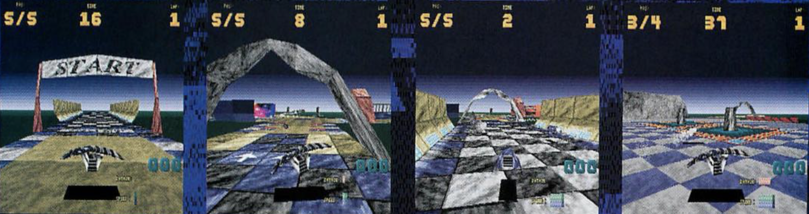

# Drifter

## Introduction

A game for 32-bit ARM-based [**Acorn Archimedes** computers](https://en.wikipedia.org/wiki/Acorn_Archimedes), released in January 1997 by [**The Fourth Dimension**](https://en.wikipedia.org/wiki/The_Fourth_Dimension_(company)). 

**Drifter** was written primarily in ARM assembler, with some higher-level functionality written in BBC BASIC. It featured software 3D-rendering and texture-mapping when home computers did not carry any hardware 3D acceleration. The release was initially on 3.5-inch floppy disk (1x1.6Mb floppy disk or 2x800Kb floppy disks), and later in various compilation CD-ROMs. Sales were mainly via mail order from retailers or direct from the publisher.

## Download

Over 25 years since release, the commercial life of Drifter has long-since passed, along with the computer platform on which it was designed to run. This repo is an attempt to preserve a small part of the original Acorn software catalogue and make the game available and playable on more hardware.

The [Drifter version available here](https://github.com/AcornDrifter/Drifter/blob/main/Drifter%20(32-bit%20compatible).zip) has been updated for compatibility with modern 32-bit RISC OS beyond version 3. With thanks to Jon Abbott at JASPP for the generous technical help. Transfer the [Drifter (32-bit compatible).zip](https://github.com/AcornDrifter/Drifter/blob/main/Drifter%20(32-bit%20compatible).zip) to the emulator or real hardware first, and then unzip the archive within RISC OS itself to preserve the file types within the **`!Drifter32`** folder.

## Source code

The source code is available in a [readable form here on GitHub](Source/!RunImage.txt). The BBC BASIC (tokenized) form of the same file is also provided. If you're interested enough to tinker with the source code, shift-double-click on **`!Drifter32`**, and shift-double-click on **`!RunImage`** to view and edit the source code. [StrongEd](http://stronged.iconbar.com) is highly recommended.

Feel free to tinker with, or improve the game in any way and share any results in this repo, via branches or pull requests.

## Background

Drifter was not a particularly good game, nor was it well-loved or popular. It did, in some respects, push the boundaries of the hardware at the time. 

The game was the culmination of the efforts of a naive teenager, working without access to the internet or any comprehensive reference material. Learning to work in assembly language and figuring out everything from first principles or small scraps of collected information.

It's clear that figuring-out software-3D, rasterization, texture-mapping and everything in-between, the hard-way, was a very significant growing and learning experience. It turned out to be an excellent foundation for a long career in the video games industry and beyond.

## Archiving

The Acorn Archimedes has a unique place in computing history. The mobile-computing-age-defining [ARM chip and architecture](https://en.wikipedia.org/wiki/ARM_architecture_family) was designed and developed for the computer.

As the original author of the Drifter, I didn't particularly look back on the game with any pride or take care to archive development material, or keep much of anything associated with the game for very long. More than 25 years after Drifter's release all the details around how it was built are fading. It's next-to-impossible to find a copy online or run the game under emulation, let alone look back through any source code.

I was pleased to discover some efforts had been made by Jon Abbott of the [JASPP](https://forums.jaspp.org.uk/forum/index.php) (Archimedes Software Preservation Project) to archive and update Drifter. Jon fixed it for use on versions of RISC OS beyond its original design, making it run on [RISC OS OPEN on Raspberry Pi](https://www.riscosopen.org/content/downloads/raspberry-pi).

## History

The introduction of [Virtua Racing](https://en.wikipedia.org/wiki/Virtua_Racing) to arcades in 1992 and Star Fox for SNES in 1993 triggered some obsessive and haphazard experiments with 3D projection and rotation techniques using BBC BASIC and later assembler.

Earlier incarnations of what ended up being Drifter were inspired by [F-Zero](https://en.wikipedia.org/wiki/F-Zero_(video_game)) and other 16-bit Super Nintendo games featuring the so-called [Mode 7 'texture-mapping' floor plane effect](https://en.wikipedia.org/wiki/Mode_7). 

## Limitations

The lack of any real reference material was a major limitation. The [full set of programming manuals](http://www.riscos.com/support/developers/prm_index/prmindex.html) for the computer were very expensive and therefore out-of-reach. Knowledge of the OS-level API was pieced together from snippets in magazines or by digging around in existing software.

The majority of the game was written on a 12 MHz Archimedes A3010 upgraded from 1Mb to 2Mb RAM. The computer had no hard-disk which meant all of the work relied on the floppy disk drive, which became a major time bottleneck.

While ARM-assembler is beautifully designed and elegant work with, the lack of a divide instruction and floating-point support required division in software (eg using tables of 1/x and multiplies) and fixed point math techniques using barrel-shifts.

## Context

Texture-mapping and 3D on home computers in '94-'95 seemed quite boundary-pushing and remarkable. It became much more mainstream after the Sony PlayStation and Sega Saturn arrived in the UK late '95. What seemed fresh and boundary-pushing early in Drifter's development, soon looked dated and compared rather badly in the year after Drifter's release.

## Technical demos

Texture-mapping became an obsession after seeing [Ridge Racer](https://en.wikipedia.org/wiki/Ridge_Racer) on its introduction to arcades in 1993. It took a long time to figure out how to do better 3D math, software rasterization, Gouraud shading and eventually texture-mapping. A couple of these experiments were generously published in [Acorn User magazine](https://en.wikipedia.org/wiki/Acorn_User) and included on the cover floppy-disk, albeit many, many months after their original submission.

* [Acorn User Gouraud Demo, *info feature](https://archive.org/details/AcornUser173-Oct96/page/n75/mode/1up)
* [Acorn User Cube *info feature](https://archive.org/details/AcornUser176-Xmas96/page/n80/mode/1up)
* [Acorn User Development Teaser](https://archive.org/details/AcornUser174-Nov96/page/n81/mode/1up)

## Magazine coverage

Towards the end of the platform's popularlity in the UK, two specialist Acorn magazines were readily available on UK high-streets, [Acorn User](https://en.wikipedia.org/wiki/Acorn_User) and [Archimedes World](https://archive.org/search.php?query=acorn%20archimedes%20world). 

* [Acorn User Preview](https://archive.org/details/AcornUser177-Jan97/page/n62/mode/1up)
* [Acorn User Review](https://archive.org/details/AcornUser183-Jul97/page/n55/mode/1up)

## Magazine Advertising

Advertising in the Acorn high-street magazines seemed like a big deal at the time. I was pleased to see the amount of full-page advertising given to Drifter for months after the game's release. 

[Acorn User, First Advert](https://archive.org/details/AcornUser179-Mar97/page/n58/mode/1up)

[Acorn User, Improved Advert](https://archive.org/details/AcornUser181-May97/page/n61/mode/1up)

